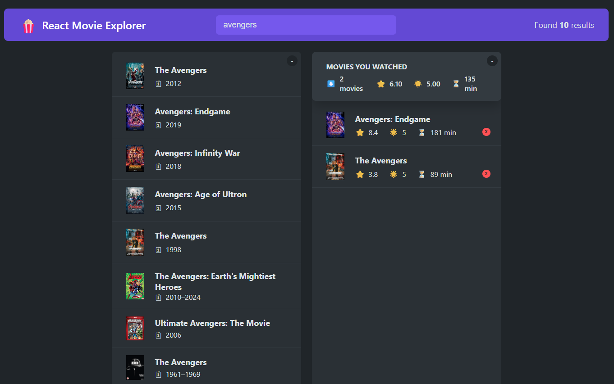

# 🎬 React Movie Explorer

A movie search application built with React and TypeScript using the OMDb API.

This project started as part of a React learning course and was later redesigned using enterprise software architecture principles.

## Preview



## Features

- Search movies using OMDb API
- Movie details
- Watched movies list
- Local persistence

## Technical Highlights

- React + TypeScript
- Custom Hooks
- Generic LocalStorage Hook
- Service Layer
- Reusable Utilities
- Environment Configuration
- Barrel Exports
- Strong Typing
- AbortController support

## Folder Structure

components/
hooks/
services/
utils/
config/
types/

## Improvements

- Extracted HTTP logic into Services
- Created reusable storage utilities
- Generic custom hooks
- Fully typed with TypeScript
- Separation of UI and business logic

## Environment Variables

Create a `.env` file in the project root.

Example:

```env
REACT_APP_OMDB_API_KEY=your_api_key_here
REACT_APP_DEFAULT_TITLE=Browser tab title
```

## Acknowledgements

This project started as part of Jonas Schmedtmann's React course.

The original course implementation was built with JavaScript. This version was redesigned using TypeScript and enterprise software architecture principles, including a service layer, reusable utilities, custom hooks, and stronger separation of concerns.
